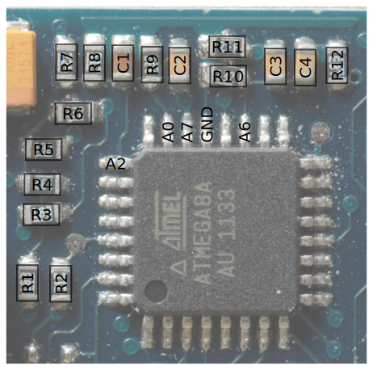
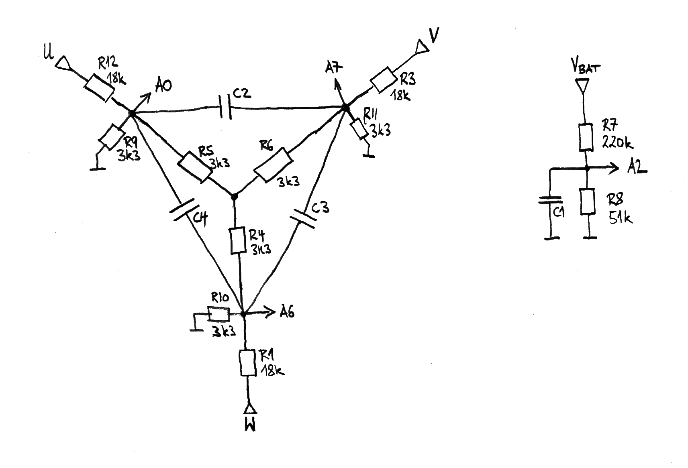

Mystery Programmable Brushless ESC, 40 A SBEC (ordered from [[http://www.hobbyking.com/]]).
* [[Front (logic) side PCB photo|http://0x.ca/sim/esc/Mystery_40A/img_4547.jpg]]
* [[Back (power) side PCB photo|http://0x.ca/sim/esc/Mystery_40A/img_4549.jpg]]
* FETs (only N-channel): [[IRF8736|http://www.irf.com/product-info/datasheets/data/irf8736pbf.pdf]]
* Gate driver: [[IR2101S|http://www.irf.com/product-info/datasheets/data/ir2101.pdf]]
* Microcontroller: Atmel ATMEGA8L, 32 pin package

AVR8 pin map
------------
|Signal      |Pin |
|------------|----|
| UH         | 26 |
| UL         | 12 |
| VH         | 28 |
| VL         | 27 |
| WH         | 2  |
| WL         | 9  |
| BAT (A2)   | 25 |
| USTAR (A0) | 23 |
| VSTAR (A7) | 22 |
| WSTAR (A6) | 19 |
| +5V        | 4, 6, 18 |
| GND        | 3, 5, 21 |

Sensorless Commutation
----------------------

